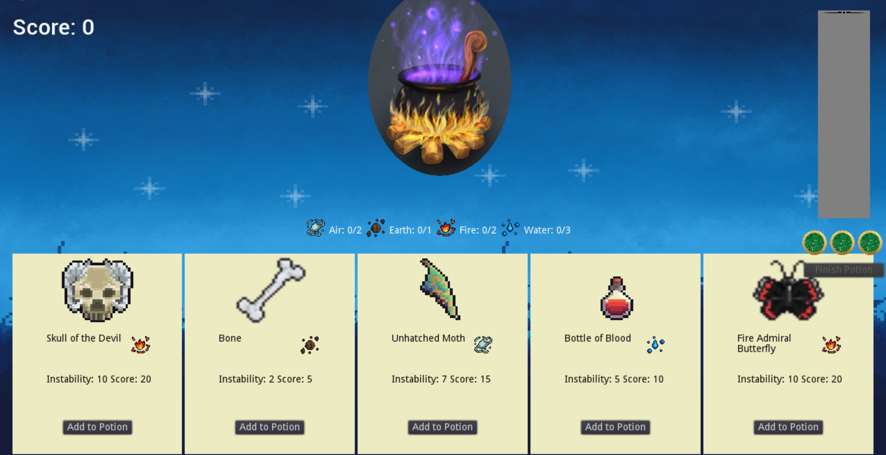

# Witches Cauldron

Welcome to Witches Cauldron! A game created for ludum dare 49. 

## How to Play:
You can play [in your browser](https://jackslinger.github.io/ludum-dare-49/).

The aim of the game is to create a potion with the highest score without the potion boiling over 3 times. 
- Choose one of the 5 ingredient cards to add to the potion
- Each card has a score value which will be added to your score
- Each card has an instability value that adds to the risk of the potion boiling over
-  Your stability bar starts at 100. Each ingredient you add will decrease this by the instability score on the card
- When an ingredient is added a random number between 1 and 100 will decide the instability of the potion. If this number is less than the current stability you are safe and the points get added to your score. If the number is higher than the stability line the potion boils over and one of the markers will turn red. 
- If all 3 markers turn red you loes the game with 0 points
- Once you have the required ingredients of certain elements (represented on the card) and you are happy with your score you can choose to finish your potion. This will give you a final score. 

## Development

Developed using the GODOT engine.

## Deployment

Automatically deploys to github pages when pushed to the main branch.

## Resources used

Texture packs used:

- [Admurin's Skill Icons](https://admurin.itch.io/admurins-skill-icons)
- [Admurin's Miscellaneous Items](https://admurin.itch.io/admurins-miscellaneous-items)
- [Admurin's Insect Items](https://admurin.itch.io/admurins-insects)
- [Admurin's Potions](https://admurin.itch.io/admurins-potions)
- [The Midnight Background](https://thewisehedgehog.itch.io/tmb)

Audio from:
- [Daily Life Sound Effects Asset Pack](https://mayragandra.itch.io/homesoundeffects)